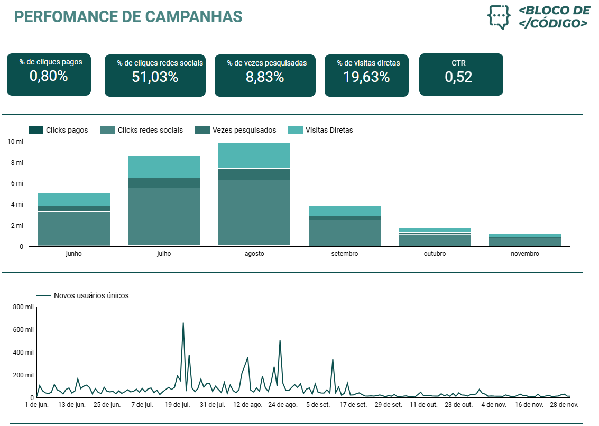

# Dashboard de Performance de Campanhas – Bloco de Código

Este dashboard foi desenvolvido no Looker Studio com o objetivo de analisar o desempenho de campanhas da empresa fictica Boco de Código.
A partir dos dados disponibilizados em uma planilha do Google Sheets, foram visualizadas métricas essenciais para tomada de decisão estratégica.

---

## 🛠️ Ferramentas Utilizadas

- Google Sheets (fonte de dados)
- Looker Studio (visualização de dados)

---

## 📷 Visão Geral

---

## 🔗 Acesse o Dashboard Online

[👉 Ver no Looker Studio](https://lookerstudio.google.com/reporting/4e587114-d828-4d7a-be1b-bea7e1d03d8e)

---

