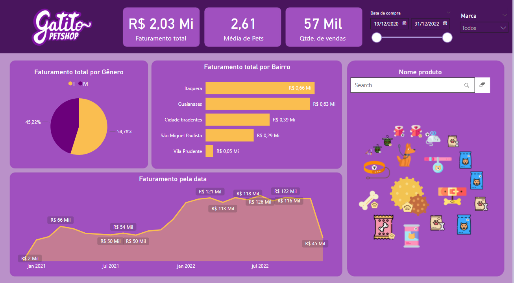

# Dashboard Power BI – Petshop

Este projeto apresenta um dashboard interativo criado no Power BI com base em dados fictícios de um petshop. O objetivo é fornecer uma visão estratégica e simplificada do desempenho do negócio.

## Sobre o Projeto

Este dashboard foi desenvolvido com o objetivo de analisar dados operacionais e financeiros de um petshop fictício.

Através da visualização dos dados no Power BI, é possível responder a perguntas-chave do negócio, como:

1. Qual é o faturamento total?
2. Qual a média de pets atendidos (gatos e cachorros)?
3. Quantos produtos foram vendidos no total?
4. Como está o faturamento por bairro?
5. Como o faturamento evoluiu ao longo dos anos e meses?
6. Qual é o faturamento total segmentado por sexo dos tutores?

As respostas a essas perguntas são exibidas de forma visual e interativa no dashboard, oferecendo uma visão rápida e estratégica do desempenho do petshop.

## Ferramentas Utilizadas

- **Power BI Desktop**
- **Excel** (fonte dos dados)

## Visão do Dashboard

> O dashboard possui apenas uma página, com uma visão integrada de todos os principais indicadores.

## Arquivos

- [`petshop.pbix`](petshop.pbix)
- 

## 📌 Fonte dos Dados

Os dados são fictícios, amplamente usados em bootcamps e treinamentos de Power BI.

