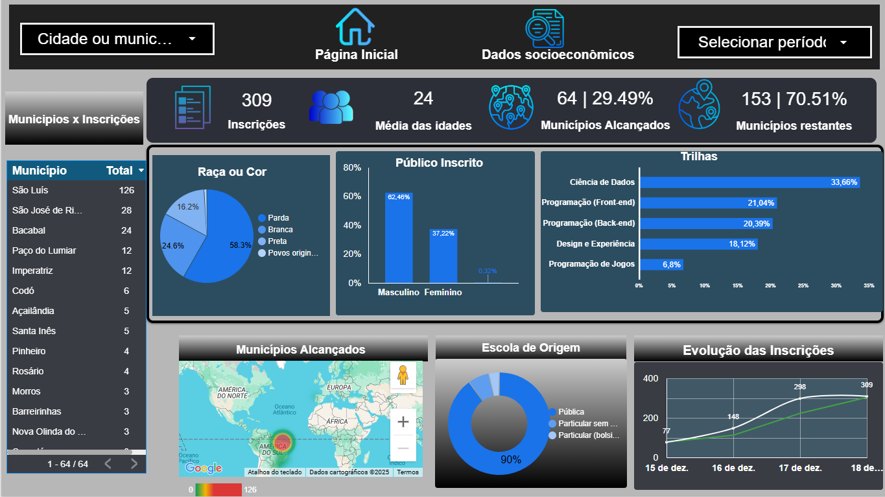
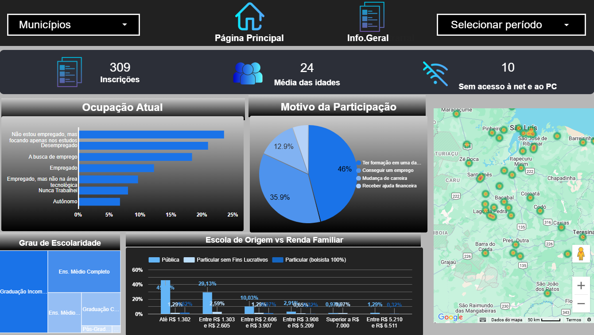

##  🎓 Dashboard – Perfil dos Estudantes do Programa Trilhas (MA)

Este dashboard foi desenvolvido no Looker Studio para visualizar e analisar o perfil dos estudantes participantes do programa educacional **Trilhas**, promovido pelo Governo do Maranhão. 
O objetivo é proporcionar uma visão clara e interativa sobre os dados sociodemográficos e educacionais dos alunos.

---

## 📊 Métricas e Análises Apresentadas

- Distribuição dos estudantes por **município**
- Comparativo por **gênero**
- Origem educacional (**escolas de origem**)
- Evolução das **inscrições ao longo do tempo**
- Análise da **média de idades**
- Indicadores **socioeconômicos**

---

## 🛠️ Ferramentas Utilizadas

- Google Sheets (dados fictícios)
- Looker Studio (criação do dashboard)

  
---

## 📷 Visão Geral

### Página 1 – Panorama Geral

### Página 2 – Dados Socioeconômicos (opcional)

---

## 🔗 Acesse o Dashboard Online

[👉 Ver no Looker Studio](https://lookerstudio.google.com/reporting/d569a119-f9c8-4488-9eb0-9327e34bab90)

---

